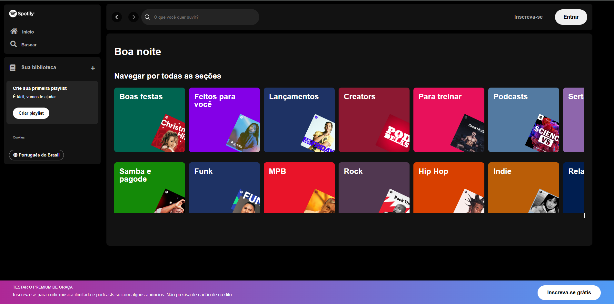

# Front-end Spotify Clone

Clone da interface front-end do Spotify, desenvolvido com o objetivo de praticar e demonstrar habilidades em desenvolvimento web, utilizando tecnologias modernas como HTML, CSS e JavaScript.

## 🚀 Tecnologias Utilizadas

- **HTML5**: Estruturação do conteúdo da página.
- **CSS3**: Estilização e design responsivo.
- **JavaScript**: Interatividade e funcionalidades dinâmicas.

